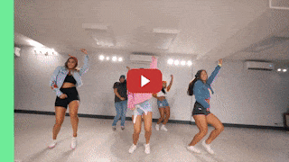

# Robust Video Matting (RVM)


<p align="center">English | <a href="README_zh_Hans.md">中文</a></p>

Official repository for the paper [Robust High-Resolution Video Matting with Temporal Guidance](https://peterl1n.github.io/RobustVideoMatting/). RVM is specifically designed for robust human video matting. Unlike existing neural models that process frames as independent images, RVM uses a recurrent neural network to process videos with temporal memory. RVM can perform matting in real-time on any videos without additional inputs. It achieves **4K 76FPS** and **HD 104FPS** on an Nvidia GTX 1080 Ti GPU. The project was developed at [ByteDance Inc.](https://www.bytedance.com/)

<br>

## Showreel
Watch the [showreel](https://youtu.be/Jvzltozpbpk) to see the model's performance. 

<p align="center">
    <a href="https://youtu.be/Jvzltozpbpk">
        
    </a>
</p>

All footage in the video are available in [Google Drive](https://drive.google.com/drive/folders/1VFnWwuu-YXDKG-N6vcjK_nL7YZMFapMU?usp=sharing) and [Baidu Pan](https://pan.baidu.com/s/1igMteDwN5rO1Sn7YIhBlvQ) (code: tb3w).

<br>


## Webcam Demo
Try [webcam demo](https://peterl1n.github.io/RobustVideoMatting/#/demo). Visualize the model in your browser.

<br>

## Download

We recommend MobileNetv3 models for most use cases. ResNet50 models are the larger variant with small performance improvements. Our model is available on various inference frameworks. See [inference documentation](documentation/inference.md) for more instructions.

<table>
    <thead>
        <tr>
            <td>Framework</td>
            <td>Download</td>
            <td>Notes</td>
        </tr>
    </thead>
    <tbody>
        <tr>
            <td>PyTorch</td>
            <td>
                <a  href="https://drive.google.com/file/d/15S4LrDHBZVfp8jBpNfCFXwMqYm9qSCA-/view">rvm_mobilenetv3.pth</a><br>
                <a  href="https://drive.google.com/file/d/15xD_v-v9lMiEJWW3UkXDUe0RAxvUnCuP/view">rvm_resnet50.pth</a>
            </td>
            <td>
                Official weights for PyTorch. <a href="documentation/inference.md#pytorch">Doc</a>
            </td>
        </tr>
        <tr>
            <td>Torch Hub</td>
            <td>
                Nothing to download.
            </td>
            <td>
                Upcoming.
            </td>
        </tr>
        <tr>
            <td>TorchScript</td>
            <td>
                <a  href="https://drive.google.com/file/d/1WZsb7BLXk5n-8WYrR3A0DD8aOuc_Dl_H/view">rvm_mobilenetv3_fp32.torchscript</a><br>
                <a  href="https://drive.google.com/file/d/1aZ8vJujNw44kND_ONkF-nLpyXw4cckJI/view">rvm_mobilenetv3_fp16.torchscript</a><br>
                <a  href="https://drive.google.com/file/d/18L-2Iq0aVIty2JwNcBSWT6K4cYvvQ9k0/view">rvm_resnet50_fp32.torchscript</a><br>
                <a  href="https://drive.google.com/file/d/1zYTPsu1hcdEnPYSGYWE7zrMSDQmFLbtU/view">rvm_resnet50_fp16.torchscript</a>
            </td>
            <td>
                If inference on mobile, consider export int8 quantized models yourself. <a href="documentation/inference.md#torchscript">Doc</a>
            </td>
        </tr>
        <tr>
            <td>ONNX</td>
            <td>
                <a  href="https://drive.google.com/file/d/10NJX_J0ilqSk6J03HTlmLKkU22AYp0EV/view">rvm_mobilenetv3_fp32.onnx</a><br>
                <a  href="https://drive.google.com/file/d/1V4I5LZ4PhoinyupsvZuxaNDDlKAPOyOF/view">rvm_mobilenetv3_fp16.onnx</a><br>
                <a  href="https://drive.google.com/file/d/1prnA9IP48zk-L4LwYHh_CfyTj7BOcJ3W/view">rvm_resnet50_fp32.onnx</a><br>
                <a  href="https://drive.google.com/file/d/1gY0vK_evWNZQi_iEf35jrasX46PEtMw6/view">rvm_resnet50_fp16.onnx</a>
            </td>
            <td>
                Tested on ONNX Runtime with CPU and CUDA backends. Provided models use opset 12. <a href="documentation/inference.md#onnx">Doc</a>, <a href="https://github.com/PeterL1n/RobustVideoMatting/tree/onnx">Exporter</a>.
            </td>
        </tr>
        <tr>
            <td>TensorFlow</td>
            <td>
                <a  href="https://drive.google.com/file/d/114KBJaHITM8XmmMj7cn0V8yjLJ2kdsBS/view">rvm_mobilenetv3_tf.zip</a><br>
                <a  href="https://drive.google.com/file/d/1aB3qrBjdVv3nl5vgIsCp3JRbhMUnlHSs/view">rvm_resnet50_tf.zip</a>
            </td>
            <td>
                TensorFlow 2 SavedModel. <a href="documentation/inference.md#tensorflow">Doc</a>
            </td>
        </tr>
        <tr>
            <td>TensorFlow.js</td>
            <td>
                <a  href="https://drive.google.com/file/d/12DRwTrS3Ok4OLMSYiUe3xCrjbqXGrvmP/view">rvm_mobilenetv3_tfjs_int8.zip</a><br>
            </td>
            <td>
                Run the model on the web. <a href="https://peterl1n.github.io/RobustVideoMatting/#/demo">Demo</a>, <a href="https://github.com/PeterL1n/RobustVideoMatting/tree/tfjs">Starter Code</a>
            </td>
        </tr>
        <tr>
            <td>CoreML</td>
            <td>
                <a  href="https://drive.google.com/file/d/1fY3MU16ehqmm70V0Z4x95BB244vGf6aB/view">rvm_mobilenetv3_1280x720_s0.375_fp16.mlmodel</a><br>
                <a  href="https://drive.google.com/file/d/1MN7GSpC03I_aFpD_pVyN0kUmzgft-cLE/view">rvm_mobilenetv3_1280x720_s0.375_int8.mlmodel</a><br>
                <a  href="https://drive.google.com/file/d/1YqsMcT-e0oAr7uDaH1hoLMe24UAqMJDB/view">rvm_mobilenetv3_1920x1080_s0.25_fp16.mlmodel</a><br>
                <a  href="https://drive.google.com/file/d/1F6xCXuyHX1AX5a05D2s0fcvIw6wzsiRd/view">rvm_mobilenetv3_1920x1080_s0.25_int8.mlmodel</a><br>
            </td>
            <td>
                CoreML does not support dynamic resolution. Other resolutions can be exported yourself. Models require iOS 13+. <code>s</code> denotes <code>downsample_ratio</code>. <a href="documentation/inference.md#coreml">Doc</a>, <a href="https://github.com/PeterL1n/RobustVideoMatting/tree/coreml">Exporter</a>
            </td>
        </tr>
    </tbody>
</table>

All models are available in [Google Drive](https://drive.google.com/drive/folders/1pBsG-SCTatv-95SnEuxmnvvlRx208VKj?usp=sharing) and [Baidu Pan](https://pan.baidu.com/s/1puPSxQqgBFOVpW4W7AolkA) (code: gym7).

<br>

## PyTorch Example

1. Install dependencies:
```sh
pip install -r requirements_inference.txt
```

2. Load the model:

```python
import torch
from model import MattingNetwork

model = MattingNetwork('mobilenetv3').eval().cuda()  # or "resnet50"
model.load_state_dict(torch.load('rvm_mobilenetv3.pth'))
```

3. To convert videos, we provide a simple conversion API:

```python
from inference import convert_video

convert_video(
    model,                           # The model, can be on any device (cpu or cuda).
    input_source='input.mp4',        # A video file or an image sequence directory.
    output_type='video',             # Choose "video" or "png_sequence"
    output_composition='output.mp4', # File path if video; directory path if png sequence.
    output_video_mbps=4,             # Output video mbps. Not needed for png sequence.
    downsample_ratio=None,           # A hyperparameter to adjust or use None for auto.
    seq_chunk=12,                    # Process n frames at once for better parallelism.
)
```

4. Or write your own inference code:
```python
from torch.utils.data import DataLoader
from torchvision.transforms import ToTensor
from inference_utils import VideoReader, VideoWriter

reader = VideoReader('input.mp4', transform=ToTensor())
writer = VideoWriter('output.mp4', frame_rate=30)

bgr = torch.tensor([.47, 1, .6]).view(3, 1, 1).cuda()  # Green background.
rec = [None] * 4                                       # Initial recurrent states.
downsample_ratio = 0.25                                # Adjust based on your video.

with torch.no_grad():
    for src in DataLoader(reader):                     # RGB tensor normalized to 0 ~ 1.
        fgr, pha, *rec = model(src.cuda(), *rec, downsample_ratio)  # Cycle the recurrent states.
        com = fgr * pha + bgr * (1 - pha)              # Composite to green background. 
        writer.write(com)                              # Write frame.
```

Please see [inference documentation](documentation/inference.md) for details on `downsample_ratio` hyperparameter, more converter arguments, and more advanced usage.

<br>

## Training and Evaluation

Please refer to the [training documentation](documentation/training.md) to train and evaluate your own model.

<br>

## Speed

Speed is measured with `inference_speed_test.py` for reference.

| GPU            | dType | HD (1920x1080) | 4K (3840x2160) |
| -------------- | ----- | -------------- |----------------|
| RTX 3090       | FP16  | 172 FPS        | 154 FPS        |
| RTX 2060 Super | FP16  | 134 FPS        | 108 FPS        |
| GTX 1080 Ti    | FP32  | 104 FPS        | 74 FPS         |

* Note 1: HD uses `downsample_ratio=0.25`, 4K uses `downsample_ratio=0.125`. All tests use batch size 1 and frame chunk 1.
* Note 2: GPUs before Turing architecture does not support FP16 inference, so GTX 1080 Ti uses FP32.
* Note 3: We only measure tensor throughput. The provided video conversion script in this repo is expected to be much slower, because it does not utilize hardware video encoding/decoding and does not have the tensor transfer done on parallel threads. If you are interested in implementing hardware video encoding/decoding in Python, please refer to [PyNvCodec](https://github.com/NVIDIA/VideoProcessingFramework).

<br>

## Project Members
* [Shanchuan Lin](https://www.linkedin.com/in/shanchuanlin/)
* [Linjie Yang](https://sites.google.com/site/linjieyang89/)
* [Imran Saleemi](https://www.linkedin.com/in/imran-saleemi/)
* [Soumyadip Sengupta](https://homes.cs.washington.edu/~soumya91/)
